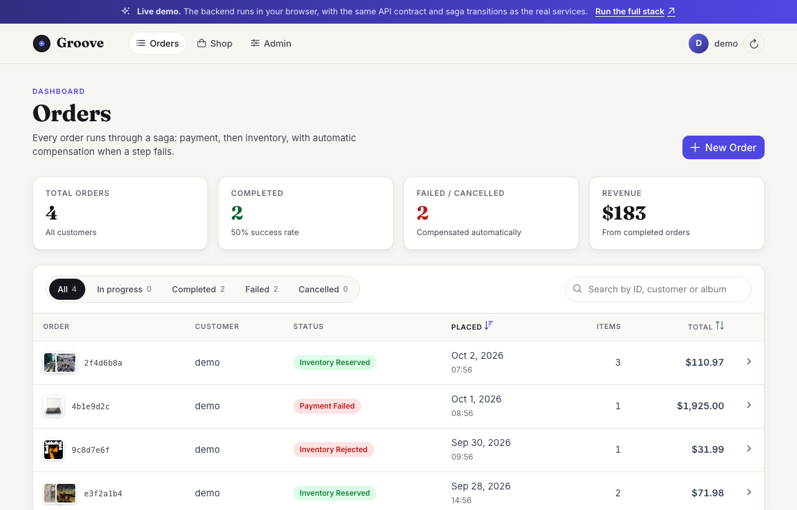
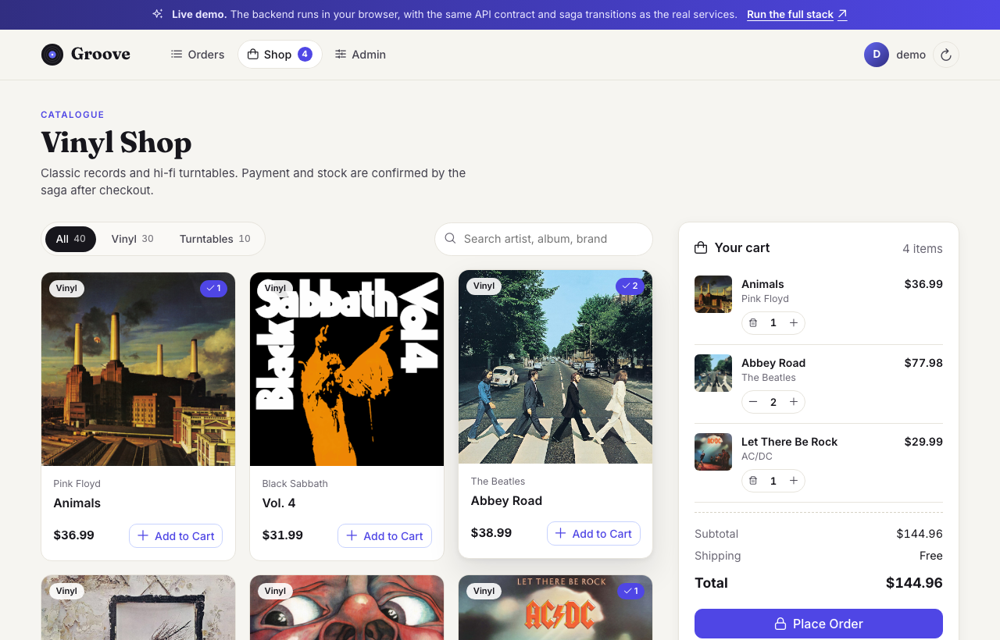
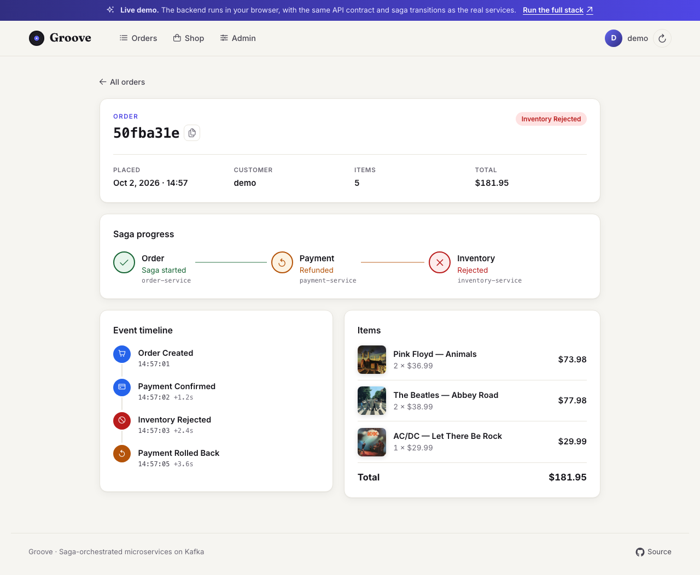
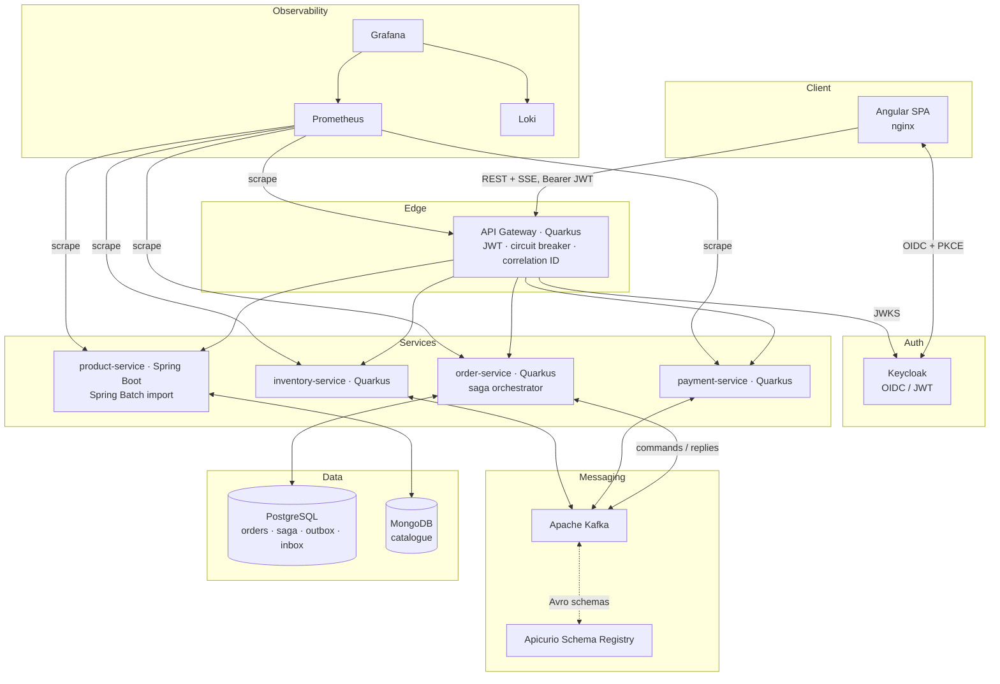
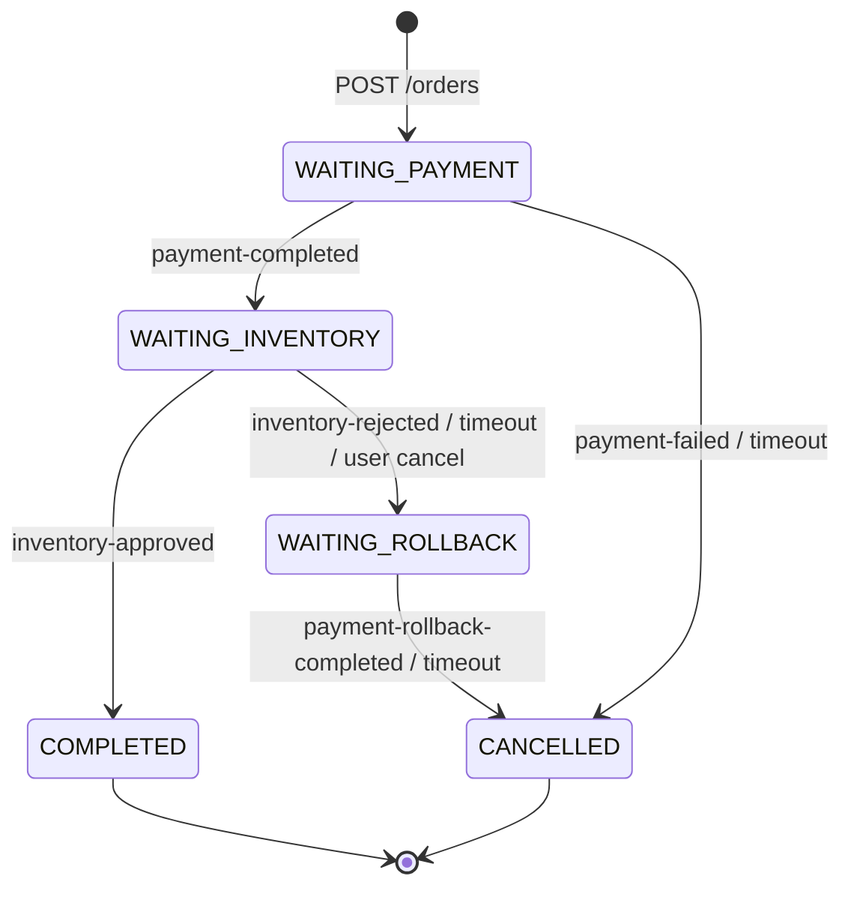
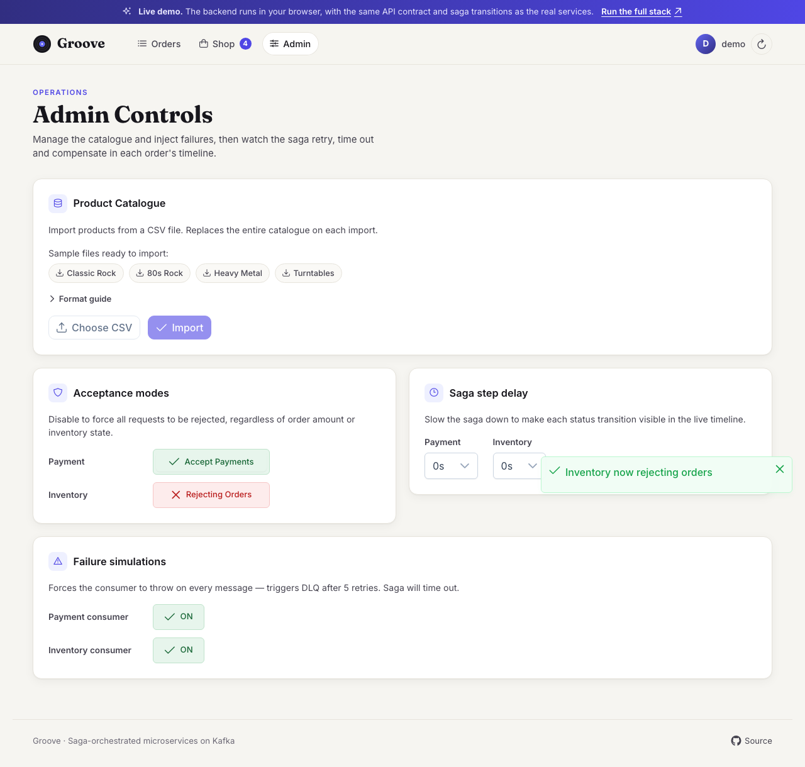
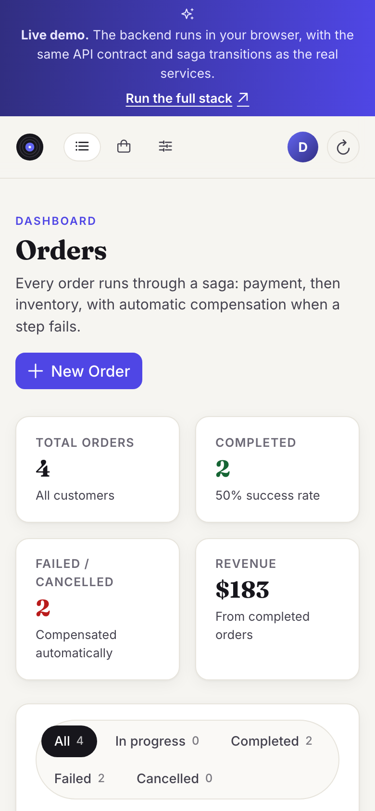
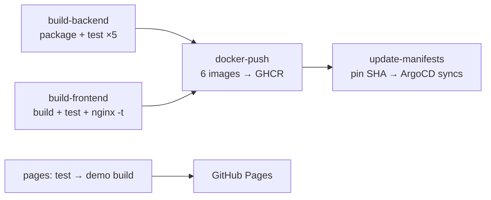

<div align="center">

# Groove

**An event-driven record store built on a saga orchestrator.**
Angular · Quarkus · Spring Boot · Kafka · Avro · PostgreSQL · MongoDB · Keycloak · Kubernetes

[](https://github.com/Vkartik-3/Angular-Java/actions/workflows/ci.yml)
[](https://github.com/Vkartik-3/Angular-Java/actions/workflows/pages.yml)
<br>


### [▶ Open the live demo](https://vkartik-3.github.io/Angular-Java/) &nbsp;·&nbsp; [Project page](https://vkartik-3.github.io/Angular-Java/docs/)



</div>

---

## Contents

- [What it is](#what-it-is)
- [Live demo](#live-demo)
- [Key metrics](#key-metrics)
- [Architecture](#architecture)
- [Order saga](#order-saga)
- [Patterns implemented](#patterns-implemented)
- [Security](#security)
- [Observability](#observability)
- [Frontend](#frontend)
- [API reference](#api-reference)
- [Running locally](#running-locally)
- [Kubernetes and GitOps](#kubernetes-and-gitops)
- [Testing](#testing)
- [CI/CD](#cicd)
- [Production readiness](#production-readiness)
- [Tech stack](#tech-stack)
- [Repository layout](#repository-layout)

---

## What it is

Groove is a production-shaped online store for vinyl records and turntables. It is a portfolio project that shows how to build a distributed system that stays **correct under failure**: payments that must be refunded, consumers that crash, messages that are delivered twice, and services that time out.

Placing an order starts a **saga** that the `order-service` orchestrates across independent payment and inventory services over Kafka. Every step is persisted, every message is idempotent, and every failure path either retries or compensates. The UI streams each state transition live, so you can watch the system recover.

| Concern | How Groove handles it |
|---|---|
| Dual writes (DB + Kafka) | Transactional outbox, written in the same transaction as the domain change |
| Duplicate delivery | Inbox table keyed by `eventId`; duplicates are discarded |
| Partial failure | Saga compensation: an inventory rejection triggers a payment rollback |
| Stuck workflows | Saga step deadlines with a timeout scanner and forced compensation |
| Poison messages | Exponential-backoff retries, then a per-topic dead letter queue |
| Client retries | `Idempotency-Key` header on order creation |
| Concurrent updates | Optimistic locking on the `Order` aggregate, with automatic retry |
| Downstream outages | Circuit breakers, timeouts and retries at the API gateway |

---

## Live demo

**[vkartik-3.github.io/Angular-Java](https://vkartik-3.github.io/Angular-Java/)**

GitHub Pages can only host static files, so the hosted demo is built with `--configuration demo`. In that build an HTTP interceptor routes every `/api/*` call to a **simulated backend that runs in your browser**. It implements the same REST contract as the API gateway and the same state machine as `OrderSagaOrchestrator`: identical status transitions, compensation, timeouts and idempotency. You don't need to log in; the demo user holds both the `user` and `admin` roles.

Things to try:

1. **Happy path.** Open **Shop**, add a few records and click **Place Order**. The order page shows the saga moving through *Order Created → Payment Confirmed → Inventory Reserved* in real time.
2. **Compensation.** In **Admin**, switch *Inventory* to **Rejecting Orders**, then place another order. Payment is charged, inventory rejects it, and the saga issues a **Payment Rolled Back** compensation.
3. **Payment decline.** Switch *Payment* to **Rejecting Payments**. The saga ends at *Payment Failed* and inventory is never contacted.
4. **Consumer crash and timeout.** Turn on a *Failure simulation*. The step never answers, the saga deadline expires and the order is cancelled, with a refund if payment was already taken.
5. **Slow motion.** Set a *Saga step delay* of 4–8 s to watch each hop individually.
6. **Catalogue import.** Download a sample CSV in **Admin** and import it. Rows that fail validation are reported individually, as they would be by the Spring Batch job.

State is kept in `localStorage`, so it survives a reload mid-saga. The circular arrow in the top bar resets the demo.

| Demo build | Full stack |
|---|---|
| Simulated gateway in the browser | Quarkus gateway + 4 services |
| Saga hops ≈ 1.2 s, step timeout 15 s | Outbox poll 5 s, step timeout 30 s |
| Status polling every 400 ms | Server-Sent Events, fanned out through Kafka |
| No login (demo user) | Keycloak OIDC, Authorization Code + PKCE |

<p align="center">
  
  
</p>

---

## Key metrics

Every figure below was measured from this repository or its build output.

### System

| Metric | Value |
|---|---|
| Deployable services | **5** (gateway, order, payment, inventory, product) + Angular SPA |
| Kafka topics | **9** business topics + **8** dead letter queues |
| Avro event schemas | **8**, registered in Apicurio Schema Registry |
| REST endpoints at the gateway | **19** |
| Flyway migrations (order-service) | **21** |
| Kubernetes manifests | **36** |
| Grafana dashboards / panels | **4** dashboards, **32** panels, provisioned as code |
| Custom Micrometer metrics | **14** business metrics (saga outcomes, duration, outbox lag, inbox duplicates, imports) |
| Java source | **119** files, **5,630** lines |
| Frontend source (TS / HTML / SCSS) | **2,050** / **623** / **1,612** lines |

### Quality

| Metric | Value |
|---|---|
| Automated tests | **106** total |
| Backend tests | **78** (order 46 · product 25 · payment 4 · inventory 3) |
| Frontend unit tests | **25** (saga planner, compensation, idempotency, CSV validation, step projection, cart) |
| Browser E2E scenarios | **3** Playwright tests against the full stack |
| Integration infrastructure | Testcontainers: PostgreSQL, Kafka, Apicurio, MongoDB |

### Frontend performance

Lighthouse 13, run on the production demo build served with gzip, as GitHub Pages serves it:

| Profile | Performance | Accessibility | Best practices | SEO | FCP | LCP | TBT | CLS |
|---|---|---|---|---|---|---|---|---|
| Desktop | **99** | **100** | **100** | **100** | 0.6 s | 0.9 s | 0 ms | 0.01 |
| Mobile (slow 4G, 4× CPU) | **82** | **100** | **100** | **100** | 3.0 s | 3.9 s | 70 ms | 0.04 |

| Bundle | Raw | Gzipped |
|---|---|---|
| Initial JS + CSS (production) | 560 kB | **134 kB** |
| Initial JS + CSS (demo) | 575 kB | **138 kB** |
| Budget (fails the build) | 750 kB | — |

Routes are lazy-loaded, and `keycloak-js` is loaded on demand, so it never ships in the initial bundle.

### Reliability settings

| Setting | Value |
|---|---|
| Outbox publisher interval / batch | every 5 s, 50 events, 5 attempts before marked dead |
| Saga step deadline / scan interval | 30 s / every 10 s |
| Kafka consumer retries | 5, exponential backoff 1 s → 30 s (×2), then `<topic>-dlq` |
| Gateway circuit breaker | opens at 50 % failures over 10 requests, half-opens after 5 s |
| Gateway timeouts | connect 1 s, read 3 s (10 s for catalogue import) |
| Retention | saga state 3 days · inbox 30 days · outbox 30 days |
| order-service rollout | 2 replicas, `maxUnavailable: 0`, `maxSurge: 1` |

---

## Architecture



| Service | Port | Stack | Responsibility |
|---|---|---|---|
| `gateway` | 8090 | Quarkus | Single entry point: JWT validation, routing, fault tolerance, correlation IDs |
| `order-service` | 8080 | Quarkus, Hibernate Panache, Flyway | Order aggregate, saga orchestration, outbox/inbox, SSE |
| `payment-service` | 8081 | Quarkus | Simulated payment processor: charge and refund |
| `inventory-service` | 8082 | Quarkus | Simulated stock check |
| `product-service` | 8084 | Spring Boot, Spring Batch | Product catalogue on MongoDB, CSV import |
| `frontend` | 80 (4200 locally) | Angular, nginx | SPA, reverse proxy for `/api` |

Each service owns its data (**database per service**): transactional state lives in PostgreSQL, and the catalogue lives in MongoDB.

---

## Order saga



| Scenario | Status history the customer sees |
|---|---|
| Happy path | Order Created → Payment Confirmed → Inventory Reserved |
| Payment declined | Order Created → Payment Failed |
| Out of stock | Order Created → Payment Confirmed → Inventory Rejected → Payment Rolled Back |
| Payment consumer down | Order Created → Order Cancelled *(after the step deadline)* |
| Inventory consumer down | Order Created → Payment Confirmed → Order Cancelled → Payment Rolled Back |

### Kafka topics

| Topic | Producer → Consumer |
|---|---|
| `payment-request`, `payment-rollback` | order-service → payment-service |
| `payment-completed`, `payment-failed`, `payment-rollback-completed` | payment-service → order-service |
| `inventory-request` | order-service → inventory-service |
| `inventory-approved`, `inventory-rejected` | inventory-service → order-service |
| `order-status-fanout` | order-service → every order-service pod (feeds SSE across replicas) |

Every saga topic has a `<topic>-dlq`. Messages are keyed by `orderId`, so all events for an order land on one partition, in order.

---

## Patterns implemented

<details open>
<summary><b>Architecture</b></summary>

- **Hexagonal architecture (ports and adapters).** `order-service` has a framework-free domain layer, an application layer with use cases and the saga, and infrastructure adapters for JPA, Kafka, the outbox and the inbox. Dependencies only point inward.
- **Domain-driven design.** `Order` is the aggregate root and guards every transition (`pay()`, `approveInventory()`, `failPayment()`…). `Money` and `OrderId` are value objects.
- **API gateway.** Typed REST clients route to downstream services. Unreachable services map to `502`, open circuits to `503`, and downstream errors pass through unchanged.
</details>

<details open>
<summary><b>Reliability</b></summary>

- **Saga orchestrator.** State is persisted per step, so a restart resumes the saga. `WAITING_ROLLBACK` exists because payment is taken before stock is checked.
- **Transactional outbox.** The domain change and its outgoing event commit together. The publisher uses `FOR UPDATE SKIP LOCKED`, so replicas never double-publish. Events that exhaust their retries flip the readiness check to unhealthy and raise an ERROR log every minute.
- **Idempotent consumer (inbox).** The `eventId` is inserted and flushed before any business logic, inside the same transaction. A rollback removes it, so the next delivery is processed cleanly.
- **Dead letter queues.** Optimistic-lock conflicts retry locally first, other failures retry with Kafka backoff, and anything left lands in `<topic>-dlq` without blocking the partition.
- **Saga timeouts.** Each step has a deadline. Expired sagas are cancelled, and charged payments are rolled back. Rollbacks that never confirm are force-cancelled, a deliberate trade of consistency for liveness.
- **Idempotent order creation.** The browser sends a UUID `Idempotency-Key`. A unique constraint resolves concurrent retries to the same order.
- **Fault tolerance.** MicroProfile retry (aborting on HTTP responses), circuit breakers and timeouts on every gateway call. `POST /orders` is never retried blindly.
- **Optimistic concurrency.** Versioned aggregate updates with automatic retry on HTTP and Kafka paths.
</details>

<details open>
<summary><b>Messaging</b></summary>

- **Avro + schema registry.** `.avsc` contracts are code-generated into typed classes and registered in Apicurio, which enables compatible schema evolution.
- **Partition-key consistency.** Every record is keyed by `orderId`, and only one message per order is ever in flight.
- **Correlation ID tracing.** `X-Correlation-ID` is generated at the gateway and propagated through HTTP headers, Kafka headers and the logging MDC of every service, then echoed back to the client.
</details>

---

## Security

- **Authentication.** Keycloak OIDC, Authorization Code flow with **PKCE (S256)**. Tokens refresh transparently before each request.
- **Defense in depth.** JWTs are validated at the gateway **and** independently by every service: signature via JWKS, plus the issuer claim. No service trusts forwarded identity blindly.
- **Authorization.** Order endpoints require any authenticated user. Users see their own orders and admins see all of them. Admin controls and catalogue import require the `admin` realm role.
- **Server-derived identity.** The customer ID comes from the token `sub` claim, never from the request body.
- **Keycloak realm hardening.** Redirect URIs are restricted to known origins (no wildcards), web origins are derived from them, brute-force detection is on, and TLS is required for external requests.
- **Secrets.** Credentials come from `.env` (Compose) or a Kubernetes `Secret`. The repository holds only templates, and Compose refuses to start when a required secret is missing.
- **Network exposure.** Every Compose port binds to `127.0.0.1`. Grafana gives anonymous users read-only access, and admin access needs a password.
- **Edge hardening (nginx).** `X-Content-Type-Options`, `X-Frame-Options: DENY`, `Referrer-Policy`, `Permissions-Policy`, hidden server tokens, gzip, immutable caching for hashed bundles and `no-cache` for the SPA shell.
- **Containers.** All Java services run as non-root users. All infrastructure images are pinned to explicit versions.

---

## Observability

| Signal | Tooling |
|---|---|
| Metrics | Micrometer → Prometheus (5 s scrape) on `/q/metrics` (Quarkus) and `/actuator/prometheus` (Spring) |
| Logs | Grafana Alloy → Loki, with structured `corrId` and `orderId` on every line |
| Kafka | `kafka-exporter`: consumer lag, offsets, DLQ depth |
| Dashboards | Grafana, provisioned from `infra/monitoring/` |

**Custom metrics:** `orders_created_total`, `sagas_completed_total{outcome}`, `sagas_compensated_total`, `sagas_timed_out_total`, `saga_duration_seconds{outcome}`, `outbox_pending`, `inbox_duplicates_total`, `payments_processed_total`, `payment_rollbacks_total`, `inventory_requests_total`, `products.imports`, `products.imported`, `products.skipped`, `products.import.failures`.

| Dashboard | Panels | Highlights |
|---|---|---|
| Saga & Orders | 9 | Outcome tiles, started vs completed vs failed, success rate, duration by outcome |
| Kafka & Messaging | 6 | Payment and inventory acceptance and rejection rates |
| Logs | 6 | Search by correlation ID across all services, per-service error streams |
| System Health | 11 | Outbox lag, inbox duplicates, DLQ counts, JVM heap and GC, gateway error rate |

On the full stack, each order page links to Grafana, pre-filtered to that order's correlation ID.

---

## Frontend

Angular 21 (standalone components, signals, `OnPush`) with PrimeNG 21 on a custom design system.

| Page | Route | Highlights |
|---|---|---|
| Orders | `/orders` | KPI tiles (orders, success rate, failures, revenue), status filters, search, album-art previews |
| Shop | `/orders/new` | Filterable catalogue grid, sticky cart, idempotent checkout, unsaved-cart guard |
| Order detail | `/orders/:id` | Live saga pipeline (order → payment → inventory), event timeline with per-step latency, items |
| Admin | `/admin` | CSV catalogue import with per-row errors, acceptance modes, step delays, crash simulation |

- **Design.** Token-based theme (`styles.scss`) and a custom PrimeNG preset (`theme.ts`). Responsive layout verified at 390 px phone width with no horizontal scroll.
- **Accessibility.** WCAG AA contrast, labelled icon-only controls, keyboard-navigable rows and `prefers-reduced-motion` support. Lighthouse accessibility score: 100.
- **Live updates.** SSE stream through the gateway in the full stack; polling in the demo build.
- **Build targets.** `production` talks to the real gateway; `demo` swaps in the in-browser backend through `environment.demo.ts`. Demo code never enters the production bundle.

<p align="center"> </p>

---

## API reference

All endpoints are served by the gateway under `/api` and require a `Bearer` token. Interactive OpenAPI docs are at `/q/swagger-ui` on the gateway.

| Method | Endpoint | Role | Description |
|---|---|---|---|
| `POST` | `/api/orders` | user | Start a saga. Returns `202 Accepted` with `Location` and `X-Correlation-ID`. Optional `Idempotency-Key` header |
| `GET` | `/api/orders` | user | Own orders (admins: all orders) |
| `GET` | `/api/orders/{id}` | user | Order with full status history |
| `GET` | `/api/orders/{id}/events` | user | SSE stream of status changes; closes on a terminal state |
| `PUT` | `/api/orders/{id}/cancel` | user | Cancel; triggers a payment rollback if already charged |
| `GET` | `/api/products` | user | Catalogue |
| `POST` | `/api/products/import` | admin | Replace the catalogue from a CSV (multipart `file`) |
| `GET`/`PUT` | `/api/payment/mode?accept=` | admin | Accept or reject all payments |
| `GET`/`PUT` | `/api/inventory/mode?accept=` | admin | Accept or reject all inventory requests |
| `GET`/`PUT` | `/api/payment/delay?seconds=` | admin | Artificial payment latency |
| `GET`/`PUT` | `/api/inventory/delay?seconds=` | admin | Artificial inventory latency |
| `GET`/`PUT` | `/api/payment/crash?enabled=` | admin | Make the payment consumer throw (exercises the DLQ) |
| `GET`/`PUT` | `/api/inventory/crash?enabled=` | admin | Make the inventory consumer throw (exercises the DLQ) |

**Error contract:** `400` validation, `401` missing or invalid token, `403` missing role, `404` unknown order, `409` concurrent modification, `502` downstream unreachable, `503` circuit open.

<details>
<summary>Calling the API from a terminal</summary>

```bash
export KEYCLOAK_URL=<your Keycloak base URL>
export GATEWAY_URL=<your gateway base URL>

TOKEN=$(curl -s -X POST "$KEYCLOAK_URL/realms/groove/protocol/openid-connect/token" \
  -d grant_type=password -d client_id=groove-app \
  --data-urlencode "username=$E2E_ADMIN_USERNAME" \
  --data-urlencode "password=$E2E_ADMIN_PASSWORD" | jq -r .access_token)

# Force the compensation path, then place an order
curl -X PUT "$GATEWAY_URL/api/inventory/mode?accept=false" -H "Authorization: Bearer $TOKEN"
curl -i -X POST "$GATEWAY_URL/api/orders" \
  -H "Authorization: Bearer $TOKEN" -H "Content-Type: application/json" \
  -H "Idempotency-Key: $(uuidgen)" \
  -d '{"items":[{"productId":"p1","quantity":1,"price":34.99}]}'
```
</details>

---

## Running locally

### Frontend only (no backend required)

```bash
cd apps/web
npm ci
npm run start:demo        # demo mode with the in-browser backend
```

### Full stack with Docker Compose

Requires Java 25, Maven and Docker with Compose.

```bash
git clone https://github.com/Vkartik-3/Angular-Java.git
cd Angular-Java
cp .env.example .env      # fill in every blank credential
mvn package -DskipTests
docker compose up --build
```

All ports bind to the loopback interface only:

| Component | Port |
|---|---|
| Web app | 4200 |
| API gateway (Swagger UI at `/q/swagger-ui`) | 8090 |
| Keycloak (admin console at `/admin`) | 8180 |
| Grafana | 3000 |
| Prometheus | 9090 |

**Create users:** sign in to the Keycloak admin console with `KEYCLOAK_ADMIN` / `KEYCLOAK_ADMIN_PASSWORD`, open the `groove` realm, and create users with your own passwords. Give customers the `user` role, and administrators both `user` and `admin`. The realm import contains no users or passwords.

| Variable | Purpose |
|---|---|
| `POSTGRES_USER`, `POSTGRES_PASSWORD` | Order database |
| `MONGO_USER`, `MONGO_PASSWORD` | Catalogue database |
| `KEYCLOAK_ADMIN`, `KEYCLOAK_ADMIN_PASSWORD` | Keycloak bootstrap admin |
| `GRAFANA_ADMIN_USER`, `GRAFANA_ADMIN_PASSWORD` | Grafana admin (anonymous users are read-only) |
| `OIDC_ISSUER` *(optional)* | Expected token issuer if Keycloak is published on another host |
| `E2E_*` *(optional)* | Accounts used by the Playwright suite |

---

## Kubernetes and GitOps

The full stack runs on Minikube from plain manifests in `infra/k8s/`. It includes Services and DNS discovery, ConfigMaps and Secrets, startup, liveness and readiness probes, resource requests and limits, StatefulSets for Kafka and the databases, and a two-replica `order-service` with zero-downtime rolling updates.

```bash
cp infra/k8s/secrets.yaml.template infra/k8s/secrets.yaml   # fill in credentials
./infra/k8s/start.sh
```

**GitOps:** CI builds images, pushes them to GHCR tagged with the commit SHA, and commits the new tags into `infra/k8s/app/`. ArgoCD watches that path and reconciles the cluster, with auto-sync enabled. Full walkthrough: [infra/k8s/README.md](infra/k8s/README.md).

---

## Testing

| Suite | Count | What it covers | Command |
|---|---|---|---|
| order-service | 46 | `@QuarkusTest` + Testcontainers (PostgreSQL, Kafka, Apicurio): full saga flows, inbox idempotency, timeouts, compensation, HTTP contract, outbox retry and batching | `cd backend/order-service && ./mvnw test` |
| product-service | 25 | CSV validation, Spring Batch skip handling, catalogue replacement (MongoDB Testcontainers), REST and multipart | `cd backend/product-service && ./mvnw test` |
| payment-service | 4 | Accept, reject, crash and rollback handling | `cd backend/payment-service && ./mvnw test` |
| inventory-service | 3 | Approve, reject and crash handling | `cd backend/inventory-service && ./mvnw test` |
| Frontend unit | 25 | Saga planner for every outcome, step delays, idempotency, cancel compensation, CSV rules, pipeline projection, cart | `cd apps/web && npm test -- --watch=false` |
| E2E (Playwright) | 3 | Happy path, compensation path, unauthenticated redirect, against the full stack | `cd apps/web && npm run e2e` |

The E2E suite needs the full stack running and the `E2E_*` variables set. It is not part of CI.

---

## CI/CD

| Workflow | Trigger | Jobs |
|---|---|---|
| [`ci.yml`](.github/workflows/ci.yml) | push / PR to `main` | Build and test all five services (Java 25), build and test the frontend, validate the nginx config, then *(opt-in)* publish six images to GHCR and pin their SHAs into the K8s manifests |
| [`pages.yml`](.github/workflows/pages.yml) | changes under `apps/web/` or `docs/` | Unit tests, demo build, SPA deep-link fallback, deploy to GitHub Pages |



**Repository settings:**

- *Live demo:* **Settings → Pages → Source: GitHub Actions**, then set the repository variable `ENABLE_PAGES_DEPLOY=true`, or run the *Deploy demo to GitHub Pages* workflow manually.
- *Image publishing:* set `ENABLE_DOCKER_PUBLISH=true` and allow GitHub Actions to write packages.

---

## Production readiness

**Already in place:** persisted, recoverable sagas; outbox and inbox with at-least-once delivery and idempotent processing; DLQs; timeouts and compensation; idempotent writes; optimistic locking; circuit breakers; JWT validation at every hop with issuer checks; PKCE; hardened realm; secrets kept out of git; non-root containers; pinned images; health probes; resource limits; rolling updates; GitOps; dashboards as code; correlation-ID tracing; performance budgets; and 106 automated tests.

**Before taking it to a real production environment:**

| Area | Next step |
|---|---|
| Transport security | Terminate TLS at the ingress (cert-manager + Let's Encrypt), enable Kafka TLS/SASL, use TLS for database connections |
| Keycloak | Run `start` (not `start-dev`) behind TLS with an external PostgreSQL, and add production redirect URIs to the realm |
| Data | Managed or replicated PostgreSQL, MongoDB and Kafka (RF ≥ 3), backups with tested restores |
| Pricing | Price items from the catalogue on the server; the client-sent price is a deliberate demo simplification |
| Secrets | External secret store (Vault, AWS Secrets Manager or Sealed Secrets) instead of a plain `Secret` |
| Scaling | HorizontalPodAutoscalers, PodDisruptionBudgets, NetworkPolicies |
| Alerting | Alertmanager rules for DLQ depth, outbox lag, saga timeout rate and error budgets |
| Supply chain | Image scanning (Trivy), SBOMs and signed images in CI |
| Frontend config | Load the Keycloak and Grafana URLs at runtime instead of baking them into the build |

---

## Tech stack

| Layer | Technology |
|---|---|
| Services | Java 25, Quarkus 3.33, Spring Boot 4.0.6, Spring Batch 6 |
| Frontend | Angular 21, PrimeNG 21, RxJS, Vitest, Playwright, nginx |
| Messaging | Apache Kafka 4.1.1, SmallRye Reactive Messaging, Avro 1.12.1, Apicurio Registry 3.1.7 |
| Persistence | PostgreSQL 18, Hibernate ORM Panache, Flyway, MongoDB 8, Spring Data MongoDB |
| Resilience | MicroProfile Fault Tolerance |
| Identity | Keycloak 26, quarkus-oidc, MicroProfile JWT, Spring Security OAuth2 Resource Server |
| Observability | Micrometer, Prometheus 3.11, Loki 3.7, Grafana Alloy 1.8, Grafana 13 |
| Delivery | Docker, Docker Compose, Kubernetes (Minikube), ArgoCD 3.5, GitHub Actions, GHCR, GitHub Pages |

---

## Repository layout

```
apps/web/                 Angular SPA (production + demo builds), nginx config, Playwright suite
  src/app/core/demo/      In-browser backend used by the GitHub Pages build
backend/
  gateway/                Quarkus API gateway
  order-service/          Saga orchestrator (hexagonal), Flyway migrations, Avro contracts
  payment-service/        Payment simulator
  inventory-service/      Inventory simulator
  product-service/        Spring Boot catalogue + Spring Batch import
infra/
  k8s/                    Kubernetes manifests, ArgoCD application, start script
  keycloak/               Realm import (no users or secrets)
  monitoring/             Prometheus, Loki, Alloy, Grafana dashboards as code
docs/                     Project page and screenshots
docker-compose.yml        Full local stack
```

---

<div align="center">
<sub>MIT licensed. See <a href="LICENSE">LICENSE</a>.</sub>
</div>
